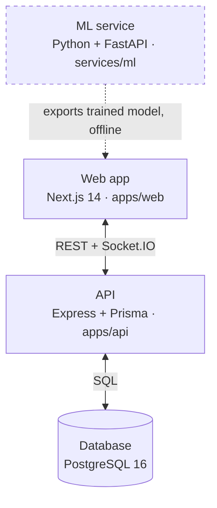

<div align="center">

# SignBridge

**A multilingual accessibility platform that lets Deaf and hearing people hold one conversation — across sign, speech, text, and a 3D avatar.**

[Live demo](https://sign-bridge-web.vercel.app) · [Source](https://github.com/KrishPrajapati1346/Sign_Bridge)

</div>

---

Most sign-language tools pick one direction — captions for a hearing person, or an avatar for a Deaf one — and make the other side adapt. SignBridge tries to put both people on equal footing in the same conversation, live, without anyone needing an app they don't already have open.

The interface itself speaks **English, Hindi, and Gujarati** — switching the language in Settings translates the whole app live, not just messages.

<details>
<summary>🇮🇳 <b>Read this intro in Hindi (हिंदी)</b></summary><br>

ज़्यादातर sign-language टूल एक तरफ़ चुनते हैं — सुनने वाले के लिए कैप्शन, या बहरे के लिए अवतार — और दूसरी तरफ़ को उसी हिसाब से ढलने देते हैं। SignBridge दोनों लोगों को एक ही बातचीत में, लाइव, बराबरी पर रखने की कोशिश करता है।

इंटरफ़ेस खुद अंग्रेज़ी, हिंदी और गुजराती में बोलता है — Settings में भाषा बदलने पर पूरा ऐप लाइव अनुवादित हो जाता है, सिर्फ़ मैसेज नहीं।

</details>

<details>
<summary>🇮🇳 <b>Read this intro in Gujarati (ગુજરાતી)</b></summary><br>

મોટાભાગના sign-language ટૂલ્સ એક દિશા પસંદ કરે છે — સાંભળનાર માટે કેપ્શન, અથવા બહેરા વ્યક્તિ માટે અવતાર — અને બીજી બાજુને એ પ્રમાણે ગોઠવાવા દે છે. SignBridge બંને લોકોને એક જ વાતચીતમાં, લાઇવ, સરખા સ્તર પર રાખવાનો પ્રયત્ન કરે છે.

ઇન્ટરફેસ પોતે અંગ્રેજી, હિન્દી અને ગુજરાતીમાં બોલે છે — Settings માં ભાષા બદલવાથી આખી એપ લાઇવ અનુવાદિત થાય છે, ફક્ત મેસેજ નહીં.

</details>

---

## Team

|     | Name                | Role                   | Contribution                                                                                                                                                                                                              |
| --- | ------------------- | ---------------------- | ------------------------------------------------------------------------------------------------------------------------------------------------------------------------------------------------------------------------- |
| 🅺   | **Krish Prajapati** | Full-Stack Development | Led the development of the Next.js web application, Express + Prisma backend, Socket.IO signalling, and overall system integration, extending and refining the platform into its production-ready architecture.           |
| 🅿  | **Prakrati Jain**   | Full-Stack Development | Contributed to the initial development of both the frontend and backend, implementing core application features, user interfaces, APIs, and application workflows that established the foundation for the final platform. |
| 🆅   | **Vedant Bhatt**    | AI / ML Development    | Developed and integrated the sign language recognition pipeline, implementing MediaPipe-based hand tracking, landmark feature extraction, model training, and TensorFlow.js inference for real-time gesture recognition.  |

---

## Four ways in

<details open>
<summary><b>✋ Sign</b> — recognized from the webcam, entirely in the browser</summary><br>

Runs on MediaPipe Tasks Vision + TensorFlow.js. The camera feed is processed and discarded on-device — nothing is uploaded. Roughly what the model sees: **21 hand landmarks**, reduced to an **86-number feature vector**. The same extractor code runs in Python (training) and the browser (live use), so the two can't quietly drift apart.

</details>

<details>
<summary><b>🎙️ Speech</b> — spoken words become text and back again</summary><br>

Speech-to-text and text-to-speech directly in the browser via the Web Speech API — no server round trip for the audio itself.

</details>

<details>
<summary><b>💬 Text</b> — typed, and translated live across three languages</summary><br>

Text translation across English / Hindi / Gujarati, provider-agnostic (`google-free` by default, keyless — or `bhashini` / `identity`). The whole interface is localized, not just messages.

</details>

<details>
<summary><b>🧑‍🤝‍🧑 Avatar</b> — a 3D hand fingerspells the reply back</summary><br>

Built with Three.js + react-three-fiber + drei. Types out a reply letter by letter for a signer to read.

</details>

---

## Architecture



<details>
<summary><b>Web app</b> — apps/web · Next.js 14</summary><br>

Every user-facing module lives here — conversation, calls, translate, learning, emergency — plus in-browser ML inference and the i18n layer. Owned end-to-end by Krish.

</details>

<details>
<summary><b>API</b> — apps/api · Express + Prisma</summary><br>

Auth, conversation history, translation requests, call-room/ICE config, emergency data, learning progress — validated with Zod. Socket.IO handles WebRTC signalling for calls.

</details>

<details>
<summary><b>Database</b> — PostgreSQL 16 · Prisma</summary><br>

Everything the API owns lands here. Nothing ML-related touches it at runtime — the trained model ships as a static file, not a database record.

</details>

<details>
<summary><b>ML service</b> — services/ml · Python + FastAPI (offline)</summary><br>

Vedant's training pipeline builds the ISL classifier from either self-collected landmark samples or a public labeled image set, then exports it to TensorFlow.js. The file lands in `apps/web/public/models/isl/` — there's no live dependency on this service in production.

</details>

> Both the Python trainer and the browser extractor implement the same 86-dimensional landmark feature vector, so they never diverge.

---

## Stack

| Layer         | Technology                                                       |
| ------------- | ---------------------------------------------------------------- |
| Frontend      | Next.js 14, React 18, TypeScript, Tailwind CSS                   |
| In-browser ML | MediaPipe Tasks Vision, TensorFlow.js                            |
| 3D avatar     | Three.js, react-three-fiber, drei                                |
| Backend       | Node.js, Express, TypeScript, Zod                                |
| Realtime      | Socket.IO, WebRTC                                                |
| Auth          | JWT (access + refresh), bcrypt                                   |
| Database      | PostgreSQL 16, Prisma                                            |
| ML service    | Python 3.11, FastAPI, TensorFlow                                 |
| Monorepo      | pnpm workspaces, Turborepo                                       |
| Tooling       | Docker Compose, GitHub Actions, ESLint, Prettier, Vitest, pytest |

---

## Repo layout

```
signbridge/
├── apps/
│   ├── api/            Express + Prisma API (auth, conversations, translate,
│   │                   calls, emergency, learning, sign-samples) + Socket.IO
│   └── web/            Next.js web app — all user-facing modules + i18n
├── packages/
│   ├── shared-types/   TypeScript types shared across web & API
│   └── tsconfig/       Shared TypeScript configs
├── services/
│   └── ml/             Python/FastAPI — training & TF.js export
├── docker-compose.yml
└── turbo.json
```

---

## API surface

All routes mount under `/api`.

| Route                | Purpose                                     |
| -------------------- | ------------------------------------------- |
| `/api/health`        | Liveness + database connectivity check      |
| `/api/auth`          | Register, login, refresh, logout            |
| `/api/users`         | Profile and per-user settings               |
| `/api/conversations` | Conversation + message history              |
| `/api/sign-samples`  | Collected landmark samples + dataset export |
| `/api/translate`     | Text translation                            |
| `/api/calls`         | Video-call rooms + ICE/TURN config          |
| `/api/emergency`     | Contacts, quick phrases, emergency events   |
| `/api/learning`      | Lesson progress and sign mastery            |

---

## Configuration

<details>
<summary><b>apps/api/.env</b></summary><br>

| Variable                                         | Notes                                                              |
| ------------------------------------------------ | ------------------------------------------------------------------ |
| `DATABASE_URL`                                   | PostgreSQL connection string used by Prisma                        |
| `CORS_ORIGIN`                                    | Allowed origin(s) for the web app                                  |
| `JWT_ACCESS_SECRET` / `JWT_REFRESH_SECRET`       | Required in production; dev fallbacks used if unset                |
| `ACCESS_TOKEN_TTL` / `REFRESH_TOKEN_TTL_DAYS`    | Token lifetimes                                                    |
| `TRANSLATION_PROVIDER`                           | `google-free` (default, keyless), `bhashini`, or `identity`        |
| `BHASHINI_*`                                     | Optional AI4Bharat credentials; falls back to passthrough if unset |
| `TURN_URL` / `TURN_USERNAME` / `TURN_CREDENTIAL` | Optional TURN server for cross-network calls (STUN always used)    |

</details>

<details>
<summary><b>apps/web/.env</b></summary><br>

| Variable              | Notes                                       |
| --------------------- | ------------------------------------------- |
| `NEXT_PUBLIC_API_URL` | Base URL of the API, exposed to the browser |

</details>

---

## Running it

```bash
# 1. Install dependencies
pnpm install

# 2. Start PostgreSQL
pnpm docker:up

# 3. Create local env files
cp apps/api/.env.example apps/api/.env
cp apps/web/.env.example apps/web/.env

# 4. Apply the database schema
pnpm db:migrate

# 5. Run everything
pnpm dev
```

- Web app → `localhost:3000`
- API health → `localhost:4000/api/health`
- ML service (optional) → `localhost:8000/health`

<details>
<summary><b>Or run the full stack in Docker</b></summary><br>

```bash
cp .env.example .env
docker compose --profile full up --build
```

Brings up PostgreSQL, the API, the web app, and the ML service together.

</details>

---

## Training the sign classifier

Recognition runs live in the browser, but the classifier is trained **offline** by the Python ML service and exported to TensorFlow.js. Two paths are supported:

1. **Self-collected data** — capture samples in the web app at `/sign/collect`, then train against the API or an exported dataset file.
2. **Public image dataset** — train from a folder of labeled static ISL images (alphabet/digits), CPU-only.

Both extract the same **86-dimensional** feature vector, implemented identically in the Python processor and the browser extractor (`apps/web/src/lib/sign/landmark-features.ts`), so they never diverge. The trained model lands in `apps/web/public/models/isl/`; until one exists, `/sign` shows a "model not trained yet" state.

See [`services/ml/README.md`](services/ml/README.md) for full training steps.

---

## Testing

```bash
pnpm test                      # all JS/TS workspaces (Vitest)
cd services/ml && pytest       # ML service (pytest)
```

CI runs lint, type-check, and tests on every push via GitHub Actions.

---

## Honest caveats

The Hindi and Gujarati strings are best-effort, not yet reviewed by a native speaker. If a translation is missing, the app falls back from the current language → English → the raw key, so nothing breaks — it just shows up in English instead.

---

<div align="center">

Built by **Krish Prajapati**, **Prakrati Jain**, and **Vedant Bhatt**.

</div>
